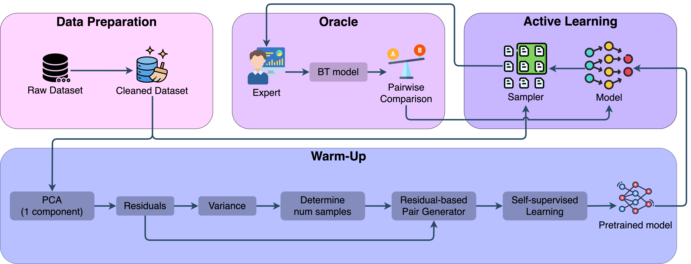

# Cold Start Active Preference Learning in Socio-Economic Domains

This repository contains the official source code and experimental setup for the paper:  
**"Cold Start Active Preference Learning in Socio-Economic Domains"**, submitted to the ....



---

## Abstract

Active preference learning is a powerful paradigm for efficiently modeling preferences, yet it suffers from the cold-start problem: a significant drop in performance when no initial labeled data is available. This challenge is particularly acute in computational social systems and economic analysis, where labeled data is often scarce, expensive, and subject to expert noise.

To address this gap, we propose a novel framework for cold-start active preference learning. Our method initiates the learning process through a self-supervised pre-training phase, utilizing Principal Component Analysis (PCA) to derive initial pseudo-labels from the data's inherent structure, thereby creating a "cold-start" model without any initial oracle interaction.

Subsequently, the model is refined through an active learning loop that strategically queries a simulated noisy oracle for labels. We conduct extensive experiments on diverse datasets from different domains, including financial credibility, career success rate, and socio-economic status. The results demonstrate that our cold-start approach outperforms standard active learning strategies that begin from a blank slate, achieving higher accuracy with substantially fewer labeled pairs. Our framework offers a practical and effective solution to mitigate the cold-start problem, enhancing the sample efficiency and applicability of preference learning in data-constrained environments.

---

## Framework Overview

Our proposed framework consists of four main stages designed to efficiently learn preferences from a cold start:

1. **Data Preparation**  
   Raw data is cleaned, preprocessed, and standardized. Categorical features are intelligently encoded into numerical or one-hot representations.

2. **Warm-Start Pre-training**  
   A self-supervised phase where Principal Component Analysis (PCA) is used to generate pseudo-labels. An initial XGBoost model is pre-trained on these labels to give it a "warm start."

3. **Simulated Expert Oracle**  
   An oracle that mimics a real-world expert by providing preference labels with stochastic noise, modeled using the Bradley-Terry model.

4. **Active Learning Loop**  
   The warm-started model is incrementally refined by strategically querying the oracle for new labels, focusing on the most informative data pairs.

---

## Repository Structure

```
.
├── Config/
│ └── util.py           # Utility functions
├── Datasets/           # Directory for datasets
├── FIFA/               # Initial Jupyter notebooks for the FIFA dataset (Different experiments were done here)
├── Images/             # Output directory for generated plot images
├── Plots/              # Output directory for plots' data
├── *.ipynb             # Notebooks for datasets
├── plot_generator.py   # Code to generate plots from saved data
└── README.md           # This file
```

---

## Download Datasets

Please download the datasets used in the study and place them in the `data/` directory.

All datasets can be downloaded directly **except** the Household dataset due to its large size. You can download it from the following link:

**[Download Household Dataset](https://mega.nz/file/bAkGxZ5Q#2p7BzZ0qufV3GfyzP8ik2jn4RkHE_1MSu0WscvILb7o)**

---

## Usage and Replication

The experiments can be run from the notebooks. The core logic for running a comparative experiment is outlined below.

---
### Example Experiment Script

This block illustrates the main loop used to run the experiments for a given scenario (e.g., low-data with repetitions or an extended single run). The parameters for the scenario are configured first, and then the main comparison function is called iteratively.

```python
# --- 1. Configure Experiment Parameters ---
# These parameters can be adjusted for different scenarios
step = 50
num_samples = 800
repeats = 40
dataset_name = "household"

# --- 2. Initialize Result Storage ---
f1_scores_UB_repeats = []
f1_scores_UP_repeats = []
f1_scores_RB_repeats = []

# --- 3. Run the Experiment Loop ---
for i in range(num_runs):
    for _ in range(repeats):
    f1_scores_UB, f1_scores_UP, f1_scores_RB = compare_three_methods(
        df=data,
        test_df=test_df,
        train_params=train_params,
        pretrained_model=pretrained_model,
        target_col=target_col_name,
        use_bradley=True,
        exp=False,
        add_noise=False,
        total_pairs=num_samples,
        batch_size=step,
    )

    # Store the results from this run
    f1_scores_UB_repeats.append(f1_scores_UB)
    f1_scores_UP_repeats.append(f1_scores_UP)
    f1_scores_RB_repeats.append(f1_scores_RB)

# --- 4. Save Final Results ---
output_path = f"Plots/{dataset_name}_f1_repeat.pkl"
save_f1_scores(output_path, f1_scores_UB_repeats, f1_scores_UP_repeats, f1_scores_RB_repeats)
```
---

### Replicating Paper Results

To replicate the figures from the paper, run the script for all policies across the relevant datasets. The results and plots will be saved to the `plots/` directory.

---

## Citation

If you use this code or our framework in your research, please cite our paper:

```
@misc{fayazbakhsh2025coldstartactivepreference,
      title={Cold Start Active Preference Learning in Socio-Economic Domains}, 
      author={Mojtaba Fayaz-Bakhsh and Danial Ataee and MohammadAmin Fazli},
      year={2025},
      eprint={2508.05090},
      archivePrefix={arXiv},
      primaryClass={cs.LG},
      url={https://arxiv.org/abs/2508.05090}, 
} 
```

---

## License

This project is licensed under the MIT License. See the [LICENSE](LICENSE) file for details.